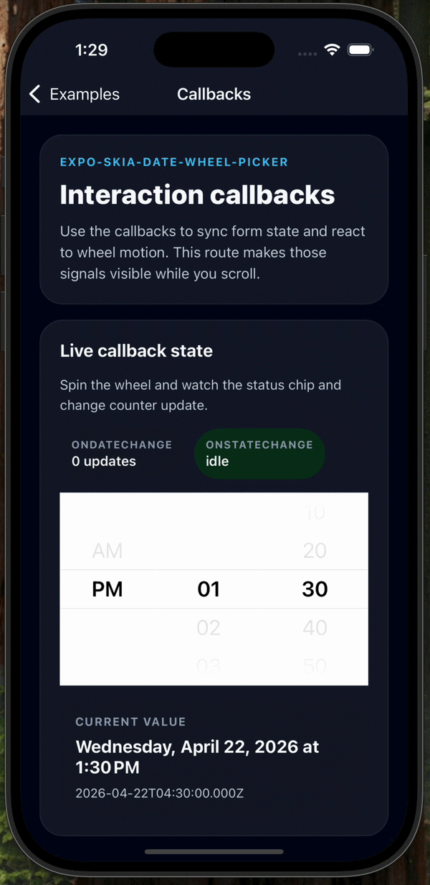

# expo-skia-date-wheel-picker

Responsive date and time wheel picker for Expo and React Native, with Skia-rendered overlays and immediate `onDateChange` updates while the wheel moves.

This package keeps the API small and predictable:

- controlled with a single `date: Date` value
- supports both `date` and `time` modes
- clamps invalid values with `minimumDate` / `maximumDate`
- snaps minutes with `minuteInterval`
- adapts to locale and 12/24-hour rules
- supports timezone-offset editing
- exposes live wheel state through callbacks

## Preview

<table>
  <tr>
    <td align="center" valign="top" width="50%">
      
      <br />
      <strong>Live callbacks while scrolling</strong>
      <br />
      Shows <code>onDateChange</code> updating immediately while the wheel moves, together with <code>onStateChange</code> feedback.
    </td>
    <td align="center" valign="top" width="50%">
      
      <br />
      <strong>Styling and layout customization</strong>
      <br />
      Shows custom colors, typography, row height, and visible row count in a dark themed configuration.
    </td>
  </tr>
</table>

## Why this picker

`expo-skia-date-wheel-picker` is built for cases where a wheel picker should feel responsive and easy to style without introducing a large API surface.

- **Immediate updates while scrolling** — `onDateChange` fires as the centered row changes, not only after the wheel becomes idle.
- **Skia-enhanced visuals** — Skia draws the fade overlays and center guide lines, which keeps the wheel presentation polished and customizable.
- **Native snapped wheel interaction** — each column uses snapped scrolling with row-based selection.
- **Simple controlled model** — no separate `value` / `defaultValue` split; the picker is driven by `date` and `onDateChange`.

> Note: Skia is used for the wheel overlay and guide rendering. The selectable rows themselves are rendered with React Native views and text.

## Features

- Date mode: `year / month / day`
- Time mode: `hour / minute`, plus `AM/PM` when 12-hour time is active
- Live `onDateChange` callback during interaction
- `onStateChange` callback with `'spinning' | 'idle'`
- `minimumDate` / `maximumDate` clamping
- `minuteInterval` support for stepped time selection
- Locale-aware labels and 12/24-hour behavior
- `timeZoneOffsetInMinutes` for editing in another timezone
- Styling props for colors, typography, row height, and visible rows

## Installation

Install the published package and required peer dependencies:

```bash
npm install @0610studio/expo-skia-date-wheel-picker
npx expo install @shopify/react-native-skia expo-haptics
```

If you are not using Expo CLI for dependency resolution, make sure `@shopify/react-native-skia` matches your Expo SDK or React Native setup.

## Basic usage

```tsx
import { useState } from 'react';
import DateWheelPicker from '@0610studio/expo-skia-date-wheel-picker';

export default function Example() {
  const [date, setDate] = useState(new Date('2026-04-22T13:30:00'));

  return (
    <DateWheelPicker
      date={date}
      mode="date"
      onDateChange={setDate}
    />
  );
}
```

You can also import the named export:

```tsx
import { DateWheelPicker } from '@0610studio/expo-skia-date-wheel-picker';
```

The package root also exports its public types, including `DatePickerProps`, `PickerMode`, `DatePartKey`, `TimePartKey`, `PickerOption`, `PickerColumn`, `WheelColumnProps`, and `HexColor`.

## Common recipes

### Time picker with stepped minutes

```tsx
import { useState } from 'react';
import DateWheelPicker from '@0610studio/expo-skia-date-wheel-picker';

export default function TimeExample() {
  const [date, setDate] = useState(new Date('2026-04-22T13:37:00'));

  return (
    <DateWheelPicker
      date={date}
      mode="time"
      minuteInterval={5}
      onDateChange={setDate}
    />
  );
}
```

### Bounded date selection

```tsx
import { useState } from 'react';
import DateWheelPicker from '@0610studio/expo-skia-date-wheel-picker';

const minimumDate = new Date('2026-04-10T00:00:00');
const maximumDate = new Date('2026-05-05T23:59:00');

export default function RangeExample() {
  const [date, setDate] = useState(new Date('2026-04-22T13:30:00'));

  return (
    <DateWheelPicker
      date={date}
      mode="date"
      minimumDate={minimumDate}
      maximumDate={maximumDate}
      onDateChange={setDate}
    />
  );
}
```

### Locale and timezone configuration

```tsx
import { useState } from 'react';
import DateWheelPicker from '@0610studio/expo-skia-date-wheel-picker';

export default function LocaleExample() {
  const [date, setDate] = useState(new Date('2026-04-22T13:30:00Z'));

  return (
    <DateWheelPicker
      date={date}
      mode="time"
      locale="ko-KR"
      timeZoneOffsetInMinutes={540}
      onDateChange={setDate}
    />
  );
}
```

### Live callback handling

```tsx
import { useState } from 'react';
import DateWheelPicker from '@0610studio/expo-skia-date-wheel-picker';

export default function CallbackExample() {
  const [date, setDate] = useState(new Date('2026-04-22T13:30:00'));
  const [state, setState] = useState<'spinning' | 'idle'>('idle');

  return (
    <DateWheelPicker
      date={date}
      mode="time"
      minuteInterval={10}
      onDateChange={setDate}
      onStateChange={setState}
    />
  );
}
```

## Props

| Prop | Type | Description |
| --- | --- | --- |
| `date` | `Date` | Controlled selected value. |
| `mode` | `'date' \| 'time'` | Picker mode. Defaults to `'date'`. |
| `onDateChange` | `(date: Date) => void` | Called when the selection changes. Fires while scrolling as the centered row changes. |
| `minimumDate` | `Date` | Lower bound for selectable values. |
| `maximumDate` | `Date` | Upper bound for selectable values. |
| `minuteInterval` | `1 \| 2 \| 3 \| 4 \| 5 \| 6 \| 10 \| 12 \| 15 \| 20 \| 30` | Minute step used in time mode. |
| `locale` | `string` | Locale used for labels and hour-cycle formatting. |
| `is24hourSource` | `'locale' \| 'device'` | Whether 12/24-hour behavior follows the locale or device setting. Defaults to `'locale'`. |
| `timeZoneOffsetInMinutes` | `number` | Edits the value using a specific timezone offset. |
| `onStateChange` | `('spinning' \| 'idle') => void` | Reports wheel interaction state. |
| `backgroundColor` | `` `#${string}` `` | Wheel background color. Also affects the Skia fade overlays. |
| `activeFontColor` | `` `#${string}` `` | Active row text color and center guide tint. |
| `disableFontColor` | `string` | Inactive row text color. |
| `allowFontScaling` | `boolean` | Enables React Native text scaling. Defaults to `false`. |
| `fontSize` | `number` | Text size for wheel rows. Defaults to `22`. |
| `fontFamily` | `string` | Optional font family for wheel rows. |
| `rowHeight` | `number` | Height of each wheel row. Defaults to `40`. |
| `visibleRows` | `number` | Number of visible rows. Even values are normalized to an odd count. Defaults to `5`. |

## Behavioral notes

- The picker is **controlled**. Pass a `date` and update it from `onDateChange`.
- `onDateChange` is designed for live synchronization, so form state can update immediately while the wheel moves.
- `minimumDate` and `maximumDate` clamp both the incoming value and the available wheel options.
- `minuteInterval` rounds to the nearest valid minute step.
- In time mode, the period column only appears when the current hour-cycle configuration uses 12-hour time.
- `timeZoneOffsetInMinutes` changes the editable clock representation without changing the overall API shape.
- `visibleRows` is normalized so the active row stays centered.
- `rowHeight <= 0` falls back to the internal default.

## Example app

This repository includes an Expo example app in [`example/`](./example). It uses **expo-router**, so each scenario has its own route.

The example app intentionally aliases the local source as `expo-skia-date-wheel-picker` for repo development. When you install from npm in a real app, import from `@0610studio/expo-skia-date-wheel-picker` as shown above.

### Included example pages

- `/` — overview and route index
- `/date` — minimal controlled date mode
- `/time` — time mode with `minuteInterval`
- `/limits` — `minimumDate` / `maximumDate`
- `/locale-timezone` — locale-aware formatting and timezone offset handling
- `/styling` — colors, row height, visible rows, and typography
- `/callbacks` — live `onDateChange` updates and `onStateChange`

### Run the example app

```bash
cd example
npm install
npm run start
```

## License

MIT
